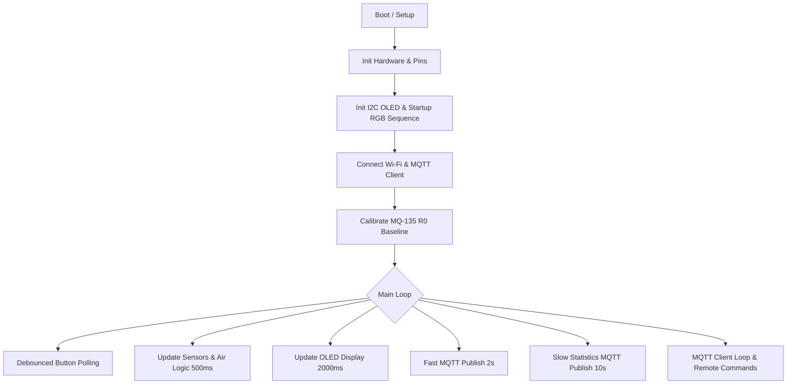

# 🏢 Elevator Telemetry & SCADA Monitoring System

A multi-tier IoT and Industrial SCADA infrastructure designed for real-time cabin climate monitoring, passenger presence tracking, and automated ventilation control.

The system bridges low-level edge hardware (ESP32-S3 with modular, non-blocking firmware) to industrial SCADA platforms (Inductive Automation Ignition) and a dedicated time-series telemetry pipeline (Node-RED, InfluxDB v2, and Grafana).

---

## 📐 System Architecture

The project is structured according to a modern 3-tier Industrial IoT pattern:

```
[ Edge Level: Sensors & Actuators ]
       │
       ▼ (Analog ADC, GPIO, I2C, PWM)
[ Controller: ESP32-S3 Firmware ]
       │
       ▼ (Wi-Fi 802.11 / JSON over MQTT)
[ Transport: Mosquitto Broker ]
       │
       ├──► [ Industrial SCADA: Ignition ] ──► Real-Time Control & HMI
       │
       └──► [ Fog/Analytics: Node-RED ] ──► Moving Average Filter ──► [ InfluxDB v2 ] ──► [ Grafana Dashboards ]

```

---

## 🛠️ Hardware Architecture

The physical sensing node is built around the **ESP32-S3** microcontroller, engineered to handle sensor acquisition, local safety thresholds, and non-blocking telemetry dispatch.

* **Microcontroller:** ESP32-S3 (Dual-Core Xtensa, integrated Wi-Fi).
* **Air Quality Monitoring:** Analog **MQ-135** sensor with multi-point baseline resistance calibration ($R_0$) and power-law PPM calculation for CO₂.
* **Occupancy Detection:** Digital **HC-SR501** PIR motion sensor.
* **Actuation & Safety Isolation:** Ventilation fan driven via a relay module with **PC817 Optocoupler** for galvanic isolation.
* **Local HMI & Status Feedback:**
* **OLED Display (SSD1306, I2C):** Visualizes live PPM values, operating state, and alarms.
* **PWM-controlled RGB LED:** Displays system diagnostics and air quality levels.
* **White LED:** Automatic motion-triggered lighting with configurable timeouts.
* **Control Buttons:** Hardware debounced buttons for system toggle and manual fan override.


*Figure 1: Hardware schematic designed in KiCad.*

---

## 💻 Firmware Design (`/firmware`)

The edge firmware is implemented with modularity and deterministic execution in mind:

* **Separation of Concerns:** Modular structure divided into `Config.h`, `SystemState.h`, `Hardware.cpp`, `Network.cpp`, and `main.ino`.
* **Non-Blocking Execution:** Zero blocking `delay()` calls in the runtime loop; all operations rely on independent `millis()` timers.
* **Dual-Rate Telemetry Publishing:**
* **Fast Stream (2000 ms):** Live metrics (`co2`, `quality_level`, `fan_running`, `motion_detected`) for real-time HMI responsiveness.
* **Slow Stream (10000 ms):** Aggregated metrics (`motion_per_min`, `fan_cycles`, `fan_on_time`, `threshold`) to minimize network overhead.


* **Fail-Safe Operation:** Automatic Wi-Fi/MQTT reconnection routine with retained message status.



---

## 🏭 Industrial SCADA: Ignition (`/scada_ignition`)

The dispatch and supervisory control level is integrated into **Ignition SCADA**:

* **Tag Engine Architecture:** Ingests MQTT payloads using structured JSON parsing directly into real-time tags.
* **Bidirectional Control:** Enables operators to toggle automatic ventilation, manually override actuators, and adjust PPM thresholds.
* **Real-Time Mimic Display:** Visual representation of cabin state, ventilation status, and motion activity.

*Figure 2: Ignition Perspective real-time monitoring interface.*

---

## 📊 Time-Series Analytics Stack (`/telemetry`)

To evaluate long-term trends and mechanical wear, telemetry is streamed into a dedicated data analysis pipeline.

### 1. Edge/Fog Processing (Node-RED)

* Ingests JSON payloads from `home/elevator/status`.
* **Moving Average Smoothing:** Applies a rolling average ($n=5$) in a JavaScript function node to eliminate analog noise before database ingestion.
* Type conversion and state normalization for clean time-series writes.

### 2. Time-Series Storage (InfluxDB v2)

* Telemetry points are mapped to the `environment` measurement within the `iot_data_n` bucket.
* Stores normalized metrics: `co2`, `avgCO2`, `motion_per_min`, `fan_cycles`, and `fan_running`.

### 3. Analytics & Visualization (Grafana)

Configured using **Flux** queries:

* **CO₂ Trend:** Moving average smoothing over windowed telemetry points.
* **Multi-Series Correlation:** Aligns passenger motion activity with subsequent rises in CO₂ concentration.
* **Operational Metrics:** Gauge indicators for average load and raw data pivot tables for debugging.

*Figure 3: Multi-parameter correlation analysis in Grafana.*

---

## 📂 Repository Structure

```
├── firmware/                 # Modular ESP32-S3 source code
│   ├── Config.h              # Pin mappings and network constants
│   ├── SystemState.h         # Global state structures
│   ├── Hardware.h / .cpp     # Sensor drivers, display, and actuators
│   ├── Network.h / .cpp      # Wi-Fi & MQTT client routines
│   └── main.ino              # Main control loop and state logic
│
├── hardware/                 # Electrical design assets
│   └── diagrams/             # KiCad exports, schematics, and flowcharts
│
├── scada_ignition/           # SCADA configuration and UI
│   ├── exports/              # Ignition project exports and tag configurations
│   └── screenshots/          # HMI views and tag bindings
│
└── analytics_grafana/        # Data processing and analytics
    ├── nodered/              # Flow JSON and JS moving average script
    ├── influxdb/             # Flux query definitions
    └── grafana/              # Dashboards and visualization screenshots

```

---

## 🚀 Getting Started

### Hardware Node Setup

1. Open the `/firmware` directory in **Arduino IDE** or **PlatformIO**.
2. Install dependencies: `Adafruit_GFX`, `Adafruit_SSD1306`, and `PubSubClient`.
3. Update Wi-Fi and MQTT credentials in `Config.h`.
4. Flash the code to the ESP32-S3 board with a baud rate of 115200.

### Analytics Stack Setup

1. Launch local services:
```bash
mosquitto -v
influxd
node-red
grafana-server

```


2. Import `telemetry/nodered/flow.json` into Node-RED.
3. Configure the InfluxDB v2 token and target bucket (`iot_data_n`).
4. Set up Grafana panels using the queries provided in `telemetry/influxdb/queries.flux`.

